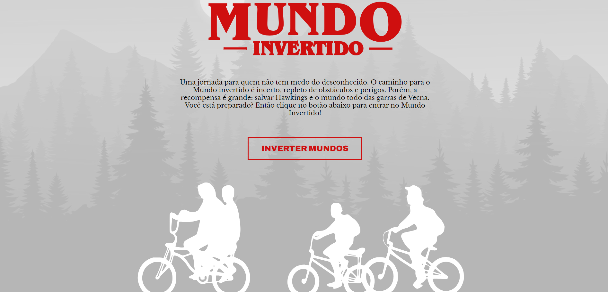

<h1 align="center">
    
    
Uma jornada para quem não tem medo do desconhecido

</h1>

 

<a style="color:blue; font-size:20px" href="https://thalia-dev07.github.io/Mundo-Invertido/">Clique para visitar o projeto</a>
 

## 🔨 Tecnologias Utilizadas

- HTML
- CSS
- JavaScript
